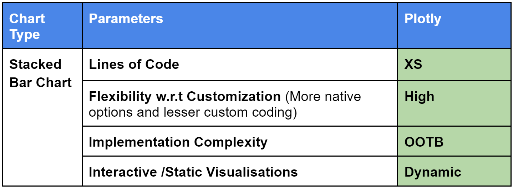

# Top 3 Python Packages For Data Visualization: A Comparative Analysis

## Introduction
Data visualization is the visual presentation of data or information for quick and impactful communication. We all have heard the phrase “Picture speaks louder than words”. According to research, our brain can recall 65% of visual data, 10 to 20% of spoken words, and only 10% of written data.  Thus data visualization communicates data or information clearly and effectively to readers in the form of graphs, charts, maps, plots, and many more. Various plots and charts help us to analyze data from all angles and efficiently extract valuable insights from data. We will be learning different types of bar charts and their customization in this article.

Who Can Benefit from Comparing Python Plotting Packages?
All aspiring Data Scientists, Machine Learning Engineers, and Artificial intelligence enthusiasts must have hands-on knowledge of Data Visualization. As it is the first step for data understanding and exploration. 
How does it benefit?
Data Visualization helps in better data understanding
Helps in identifying and highlighting key values of data
Helps in Identifying various trends and outliers
Displays complex data correlation with ease
Attracts and engages users
Helps in data exploration and making the right decisions
DataSet Introduction
We will take an ‘Adult Income Census’ dataset to explore and visualize with different libraries. In this article, we will explore the selected  ‘Adult Income Census’ dataset using different types of bar charts and their customization.
Link for the dataset:
/kaggle/input/adult-income-census/adult income1.csv

It is an income prediction dataset originated from the 1994 Census Bureau database 
The dataset has 31947 data entries and the following 12 columns:

age: Age of the individual.
workclass: The type of employment (e.g., Private, Self-emp-not-inc, Local-gov, Federal-gov, Never-worked, etc.).
fnlwgt: Final weight used in statistical sampling.
education: The highest level of education of the individual (e.g., Bachelors, Doctorate, HS-grad, 11th, 10th  Masters, etc.).
education. num: The numerical representation of education, often corresponding to the years of education.
marital.status: Marital status of the individual (e.g., Married-AF-spouse, Divorced, Never-married, Separated, etc.).
occupation: The individual's occupation (e.g., Armed-Forces, craft repair, Prof-specialty, Sales, etc.).
relationship: Relationship status of the individual (e.g., Wife, Child, Husband, Not-in-family, Other-relative, Unmarried).
race: Ethnicity or race of the individual (e.g., White, Black, Other, etc.)
sex: Gender of the individual (e.g., Male, Female).
native.country: Country of origin or native country of the individual (e.g., United States, Canada, England, Puerto Rico, etc.).
income: The target variable to be predicted indicates whether an individual's annual income is below or exceeds $50K. The value is either ">50K" or "<=50K."

We are using this dataset for data visualization as a first step in the machine learning task.

# Data Visualizations in Python
1. Bar Chart
### Characteristics Table
- Bar Chart
 
- Grouped Bar chart
 
2. Stacked Chart
### Characteristics Table
- Stacked Chart
 
- 100% Stacked Chart
 
3. Line Bar Graph
 

# Final Scorecard
In the Final Scorecard, we will compare all packages on the below parameters:
   

# Conclusion
No doubt Matplotlib, Seaborn, and Plotly all three are top Python packages for data visualizations. Matplotlib might require more lines of code to implement but it is highly interactive and simple and fast to execute. When Seaborn combined with Matplotlib both did a wonderful job for different graphs. On the other hand, Plotly might seem a little complex at first to understand, but once engineers get their hands on it, it will be like an eye-blinking job for huge data visualizations.

You can choose the Data Visualization package wisely according to the dataset, the type of chart to be prepared, and your understanding and command of the library.

